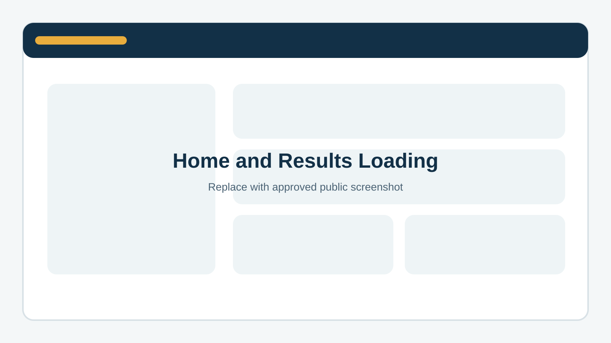
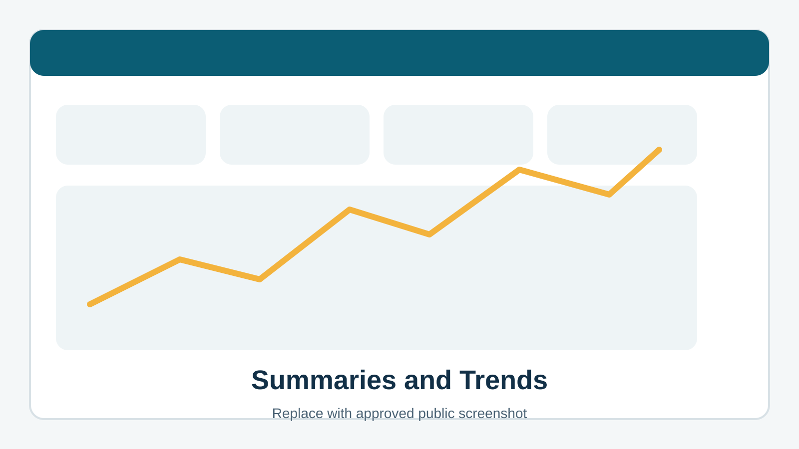
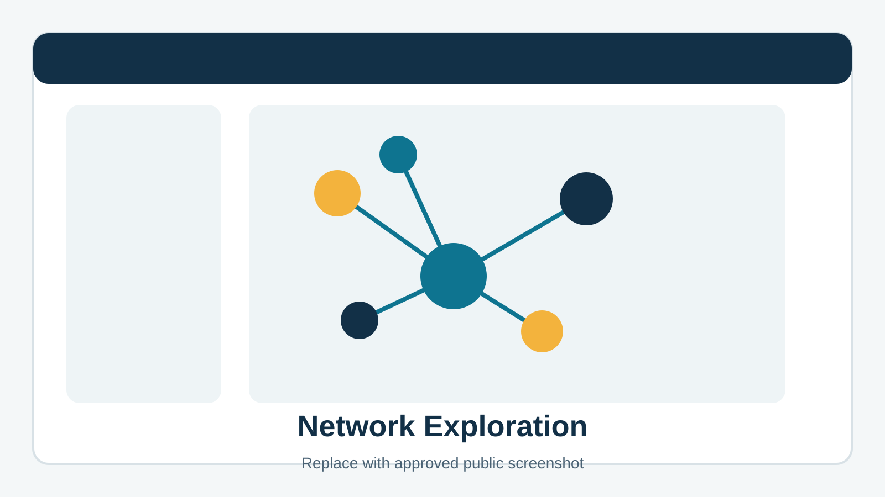
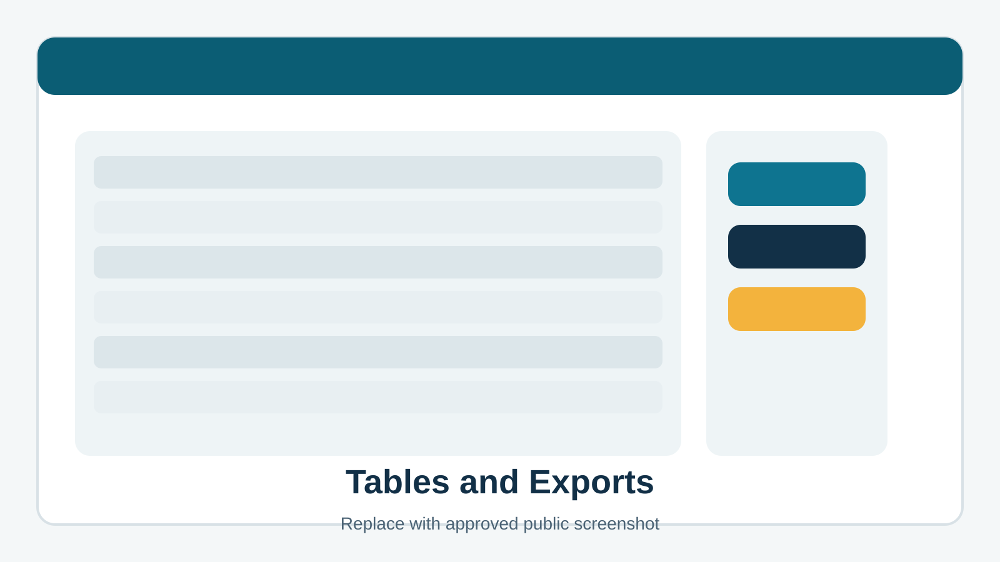

# Screenshots

This page uses branded placeholders in place of product captures in the public record repository.

## Gallery

### Home and results loading
An overview image showing how a licensed user opens SciNetX and loads a results package.

### Summaries and trends
A view focused on the main summary experience, including publication activity and trend review.

### Network exploration
A view that shows how relationship-based results are explored inside SciNetX.

### Tables and exports
A view that highlights downloadable tables, review flows, and export options.

## Explore further
- Product overview: [what_you_get.md](what_you_get.md)
- Workflow: [how_it_works.md](how_it_works.md)
- Publication: [publication.md](publication.md)
